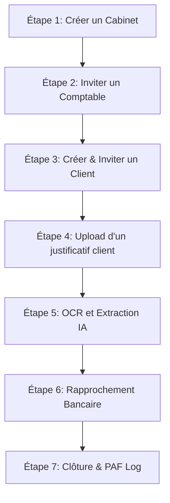

# CCS Compta - Plan de Test de Bout en Bout (E2E)

Ce document décrit le protocole et la structure des tests de bout en bout pour garantir la qualité, la sécurité multi-tenant, et la cohérence UX/UI de la plateforme CCS Compta.

---

## 1. Objectifs du Plan de Test
- **Sécurité et Isolation (Multi-Tenant) :** Vérifier que les clients ne peuvent pas accéder aux données d'autres structures, et que le personnel de cabinet (Staff) est strictement restreint à son cabinet d'appartenance.
- **Automatisation & IA :** S'assurer de la viabilité de la chaîne OCR/Document AI (dépôt $\rightarrow$ extraction $\rightarrow$ imputation) et des conversations de l'Assistant IA.
- **Continuité Bancaire :** Valider la simulation de synchronisation bancaire, l'auto-matching et la gestion des anomalies (justificatifs manquants).
- **Parcours Utilisateur Flui-SaaS :** Garantir que l'expérience client (Scanner, Trésorerie) et l'expérience cabinet (Comptable, Secrétaire, Admin) sont sans friction.

---

## 2. Tests Automatisés Existants (Playwright)

L'application intègre trois suites de tests d'intégration et de fumée (Smoke Tests) exécutables via Playwright.

### A. Matrice des Rôles & Habilitations (`roles-smoke.spec.ts`)
- **Fichier :** [roles-smoke.spec.ts](file:///c:/Users/Lenovo/Desktop/projets/ccs-compta/ccscompta/tests/smoke/roles-smoke.spec.ts)
- **Objectif :** Valider la connexion de chaque profil type et le blocage d'accès aux routes interdites.
- **Scénarios validés :**
  - **Super Admin :** Atterrit sur `/dashboard/admin` et a accès à toutes les routes.
  - **Accountant (Comptable) :** Atterrit sur `/dashboard/accountant`, accède à la gestion des clients, et se voit refuser l'accès aux routes `/dashboard/admin`.
  - **Secretary (Secrétariat) :** Atterrit sur `/dashboard/secretary`, accède à la gestion documentaire et des clients, et se voit refuser l'accès aux paramètres système/admin.
  - **Client :** Atterrit sur `/dashboard/my-documents` et se voit redirigé ou bloqué avec une page "Zone Interdite" sur toutes les routes internes de cabinet ou d'administration.

### B. Cycle de Provisioning Client (`client-provisioning-smoke.spec.ts`)
- **Fichier :** [client-provisioning-smoke.spec.ts](file:///c:/Users/Lenovo/Desktop/projets/ccs-compta/ccscompta/tests/smoke/client-provisioning-smoke.spec.ts)
- **Objectif :** Valider le parcours de création d'un nouveau compte client par un comptable.
- **Scénarios validés :**
  1. Connexion en tant que Comptable.
  2. Remplissage du formulaire de création client avec génération dynamique de SIRET et email unique.
  3. Envoi de l'email d'invitation (simulation en queue Firebase) et affichage du toast de confirmation.
  4. Redirection vers la liste des clients.

### C. Assistant IA & Flux Bancaire Client (`copilot-and-bank-smoke.spec.ts`)
- **Fichier :** [copilot-and-bank-smoke.spec.ts](file:///c:/Users/Lenovo/Desktop/projets/ccs-compta/ccscompta/tests/smoke/copilot-and-bank-smoke.spec.ts)
- **Objectif :** Valider la réactivité des outils IA et bancaires de l'espace client.
- **Scénarios validés :**
  1. Connexion en tant que Client.
  2. Navigation vers **Mon Assistant IA** (`/dashboard/copilot`), saisie d'une question financière et vérification de la persistance de la conversation.
  3. Navigation vers **Ma Banque** (`/dashboard/my-bank`) et validation de l'état connecté/non-connecté du compte bancaire sans erreur de permission.

---

## 3. Protocole de Tests Métiers Manuels (Bout en Bout)

Ce protocole doit être déroulé périodiquement avant chaque mise en production majeure.



### Étape 1 : Initialisation de l'Infrastructure (Admin)
1. Se connecter avec un compte **Super Admin**.
2. Naviguer vers **Gestion des Cabinets** (`/dashboard/cabinets`).
3. Créer un nouveau Cabinet (ex: *Cabinet Nord*).
4. Configurer la marque blanche (couleur primaire hexadécimale, nom, slogan).
5. **Critère de succès :** Le cabinet apparaît dans la liste, et les couleurs du thème s'adaptent dynamiquement lors de la consultation.

### Étape 2 : Recrutement Collaborateur (Cabinet)
1. Inviter un **Comptable** ou un **Secrétaire** sur le cabinet créé.
2. Ouvrir le lien d'invitation généré pour finaliser la création du compte.
3. Se connecter avec le compte collaborateur.
4. **Critère de succès :** L'espace d'atterrissage correspond au rôle (`/dashboard/accountant` ou `/dashboard/secretary`) avec les couleurs du cabinet configurées à l'étape 1.

### Étape 3 : Onboarding Client (B2B SaaS)
1. En tant que Comptable, aller dans **Gestion des clients** $\rightarrow$ **Nouveau Client**.
2. Utiliser l'outil **Ajout Rapide par IA** en entrant un nom d'entreprise ou un SIRET valide.
3. Valider le formulaire pré-rempli.
4. **Critère de succès :** L'email d'onboarding est envoyé au client. Le client apparaît avec le statut `onboarding`.

### Étape 4 : Dépôt & Numérisation (Client)
1. Se connecter en tant que **Client** via l'email d'invitation.
2. Naviguer vers **Scanner Mobile** (`/dashboard/scanner`).
3. Téléverser une image de facture ou un PDF :
   - *Si Image :* Tester le recadrage auto (Crop), le filtre contraste et la binarisation en Noir & Blanc.
   - *Si PDF :* Confirmer que l'écran d'édition affiche le résumé informatif du PDF sans bug de canvas, et permet de valider directement l'envoi.
4. **Critère de succès :** Le document passe au statut `pending` (en attente) et apparaît instantanément dans **Mes Achats**.

### Étape 5 : Traitement IA & Validation (Cabinet)
1. Se reconnecter en tant que **Comptable**.
2. Naviguer vers **Documents du client** (`/dashboard/documents`).
3. Cliquer sur le document déposé.
4. Valider l'extraction automatique par l'IA (Date, HT, TVA, TTC, Fournisseur) dans le formulaire de validation de données.
5. Valider la ligne d'imputation comptable suggérée.
6. **Critère de succès :** Le document passe au statut `processed` (traité). L'écriture comptable est générée dans le journal.

### Étape 6 : Rapprochement Bancaire & Anomalies
1. En tant que **Client**, aller sur **Ma Banque** (`/dashboard/my-bank`).
2. Si aucun flux n'est relié, utiliser la **Simulation Bancaire** (`/dashboard/accountant/banking-sim`) en tant que Comptable pour insérer des écritures de test.
3. Lancer le rapprochement automatique.
4. *Cas d'erreur :* Vérifier qu'une écriture sans justificatif déclenche un Toast d'erreur interactif proposant un raccourci direct vers le module d'importation.
5. **Critère de succès :** Les transactions rapprochées apparaissent cochées, et la jauge de TVA nette ainsi que le graphique de trésorerie à 90 jours dans **Mon Analyse** se mettent à jour.

### Étape 7 : Audit & Journalisation (Supervision)
1. Se connecter en tant que **Super Admin** ou **Comptable principal**.
2. Consulter le **Journal d'Audit** (`/dashboard/audit`) ou la **Piste d'Audit Fiable (PAF)** pour le document traité.
3. **Critère de succès :** Toutes les actions (dépôt, extraction IA, modification manuelle, validation) sont enregistrées de façon immuable avec le nom de l'utilisateur, l'horodatage précis, et le détail des champs modifiés.

---

## 4. Pré-requis d'Exécution & Commandes

### Variables d'Environnement (.env.smoke.local)
Pour lancer les tests automatisés Playwright localement ou en CI, créez un fichier `.env.smoke.local` à la racine :

```bash
# Variables d'authentification pour le Smoke Test
SMOKE_ADMIN_EMAIL="admin@ccscompta.fr"
SMOKE_ADMIN_PASSWORD="MotDePasseAdminSecurise"

SMOKE_ACCOUNTANT_EMAIL="comptable@cabinet-nord.fr"
SMOKE_ACCOUNTANT_PASSWORD="MotDePasseComptable"

SMOKE_SECRETARY_EMAIL="secretaire@cabinet-nord.fr"
SMOKE_SECRETARY_PASSWORD="MotDePasseSecretaire"

SMOKE_CLIENT_EMAIL="contact@vsw-digital.fr"
SMOKE_CLIENT_PASSWORD="MotDePasseClient"

# Configuration des scénarios de provisionnement
SMOKE_PROVISION_CLIENT_EMAIL="client-test-{timestamp}@vsw-digital.fr"
SMOKE_PROVISION_CLIENT_NAME="Test E2E structure {timestamp}"
SMOKE_PROVISION_CLIENT_SIRET="82838095600049"
```

### Lancement des Tests

1. **Lancement de l'émulateur Firebase (si test local) :**
   ```bash
   firebase emulators:start
   ```
2. **Lancement du serveur Next.js en mode dev ou build :**
   ```bash
   npm run dev
   # ou
   npm run build && npm run start
   ```
3. **Exécuter tous les tests E2E (sans interface graphique) :**
   ```bash
   npx playwright test
   ```
4. **Exécuter une suite spécifique avec visualisation (Headed) :**
   ```bash
   npm run smoke:roles:headed
   ```
